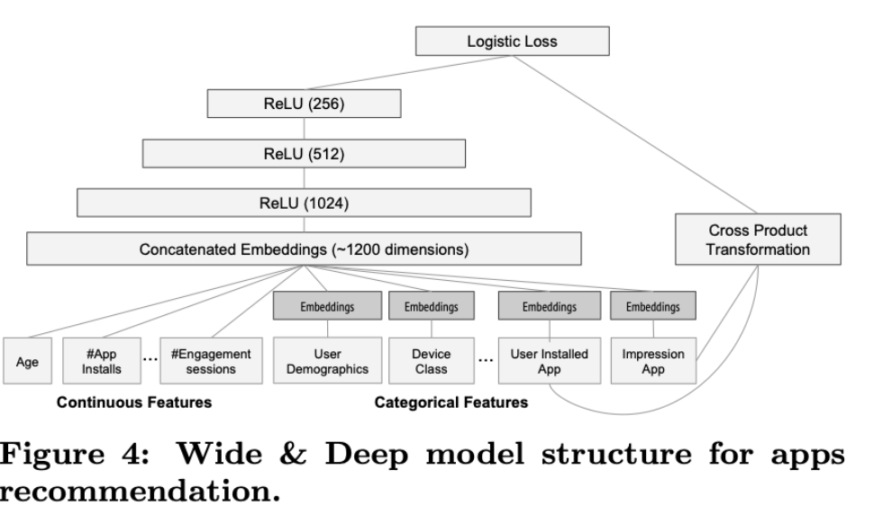
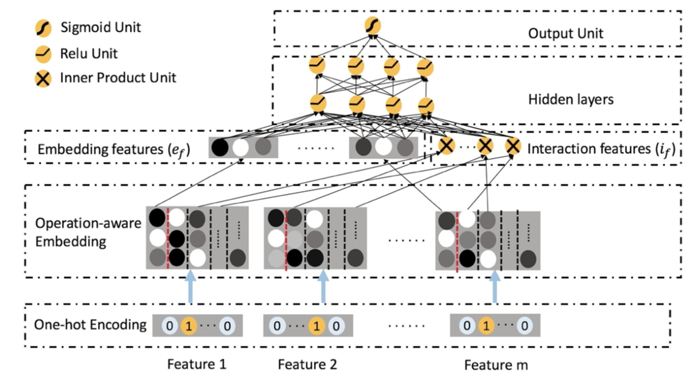

# CTR

|                 Model                  | Paper                                                                                                                                                           |
| :------------------------------------: | :-------------------------------------------------------------------------------------------------------------------------------------------------------------- |
|  [Convolutional Click Prediction Model（CCPM）](#CCPM)  | [CIKM 2015][A Convolutional Click Prediction Model](http://ir.ia.ac.cn/bitstream/173211/12337/1/A%20Convolutional%20Click%20Prediction%20Model.pdf)             |
| Factorization-supported Neural Network | [ECIR 2016][Deep Learning over Multi-field Categorical Data: A Case Study on User Response Prediction](https://arxiv.org/pdf/1601.02376.pdf)                    |
|      [Product-based Neural Network](#PNN)      | [ICDM 2016][Product-based neural networks for user response prediction](https://arxiv.org/pdf/1611.00144.pdf)                                                   |
|              [Wide & Deep](#WDL)               | [DLRS 2016][Wide & Deep Learning for Recommender Systems](https://arxiv.org/pdf/1606.07792.pdf)                                                                 |
|                 [DeepFM](#DeepFM)                 | [IJCAI 2017][DeepFM: A Factorization-Machine based Neural Network for CTR Prediction](http://www.ijcai.org/proceedings/2017/0239.pdf)                           |
|        [Piece-wise Linear Model](#LS-PLM)         | [arxiv 2017][Learning Piece-wise Linear Models from Large Scale Data for Ad Click Prediction](https://arxiv.org/abs/1704.05194)                                 |
|          [Deep & Cross Network](#DCN)          | [ADKDD 2017][Deep & Cross Network for Ad Click Predictions](https://arxiv.org/abs/1708.05123)                                                                   |
|   [Attentional Factorization Machine](#AFM)    | [IJCAI 2017][Attentional Factorization Machines: Learning the Weight of Feature Interactions via Attention Networks](http://www.ijcai.org/proceedings/2017/435) |
|      [Neural Factorization Machine](#NFM)      | [SIGIR 2017][Neural Factorization Machines for Sparse Predictive Analytics](https://arxiv.org/pdf/1708.05027.pdf)                                               |
|                [xDeepFM](#xDeepFM)                 | [KDD 2018][xDeepFM: Combining Explicit and Implicit Feature Interactions for Recommender Systems](https://arxiv.org/pdf/1803.05170.pdf)                         |
|         [Deep Interest Network](#DIN)          | [KDD 2018][Deep Interest Network for Click-Through Rate Prediction](https://arxiv.org/pdf/1706.06978.pdf)                                                       |
|    [Deep Interest Evolution Network](#DIEN)     | [AAAI 2019][Deep Interest Evolution Network for Click-Through Rate Prediction](https://arxiv.org/pdf/1809.03672.pdf)                                            |
|                [AutoInt](#AutoInt)                 | [CIKM 2019][AutoInt: Automatic Feature Interaction Learning via Self-Attentive Neural Networks](https://arxiv.org/abs/1810.11921)                              |
|                  [ONN](#ONN)                   | [arxiv 2019][Operation-aware Neural Networks for User Response Prediction](https://arxiv.org/pdf/1904.12579.pdf)                                                |
|                FiBiNET                 | [RecSys 2019][FiBiNET: Combining Feature Importance and Bilinear feature Interaction for Click-Through Rate Prediction](https://arxiv.org/pdf/1905.09433.pdf)   |
|                IFM                 | [IJCAI 2019][An Input-aware Factorization Machine for Sparse Prediction](https://www.ijcai.org/Proceedings/2019/0203.pdf)   |
|                DCN V2                    | [arxiv 2020][DCN V2: Improved Deep & Cross Network and Practical Lessons for Web-scale Learning to Rank Systems](https://arxiv.org/abs/2008.13535)   |
|                DIFM                 | [IJCAI 2020][A Dual Input-aware Factorization Machine for CTR Prediction](https://www.ijcai.org/Proceedings/2020/0434.pdf)   |
|                AFN                 | [AAAI 2020][Adaptive Factorization Network: Learning Adaptive-Order Feature Interactions](https://arxiv.org/pdf/1909.03276)   |

## CCPM

* motivation

以前的方法没有特征的交互，MF 和 FM 方法只揭示成对元素之间的相关性。
并且（基于RNN的模型）不同时间间隔的信息传播是一样的，实际中人的态度是变化的。

* method

* thoughts

目测是第一篇把cnn用到CTR任务的文章

## Factorization-supported Neural Network

* motivation

* method

DNN + 利用三种特征转换方法，即分解机（FMS），限制的Boltzmann机（RBMS）和去噪自动编码器（DAEs)

【上述方法都不了解，暂时搁置这篇paper】

* thoughts

## PNN

* motivation
* method

l1 = lz（线性信号） + lp（二次信号） + b(偏置项)

product layer，内积层

* thoughts

## WDL

* motivation

Wide & Deep learning—jointly trained wide linear models and deep neural networks—to combine the benefits of memorization（经常共同出现的items） and generalization （泛化）for recommender systems.

* mothod

pred用wide（wide linear model）和deep（nn）加权，然后计算log loss。两者参数同时更新，但是用不同的优化器更新。

## DeepFM

* motivation

现有的方法在特征交互时容易偏向低阶或高阶特征，或者需要特征工程。

为此，本文提出一种端到端的方法，能够同时加强低阶和高阶特征的交互。

本文提出的模型DeepFM，结合了分解机的推荐能力和神经网络的特征学习能力。 与谷歌的[WDL](#WDL)相比，DeepFM的“wide”和“deep”共享输入，除了原始特征以外无需额外的特征工程。

* method

* thoughts

文章写得很好，将FNN、PNN、WDL放在一起对比（但我没详细看）。

## LS-PLM

* motivation

适用于工业界大量数据高度稀疏的场景使用。2012以来，LS-PLM是阿里使用的模型（现在应该不是了）。

* method

1. 建模成带L1、L2正则的线性模型，转化成非凸非光滑的优化问题，并且提出一种高效求解的方法。

2. 设计了一个分布式系统，可以同时在成百上千个机器上并行计算，达到工业可用。

* thoughts

推导、求解、系统设计没具体看。不过，主要的线性方程还是比较简单的。

## DCN

* motivation

DNN可以自动化提取特征，但是变量之间的交互是隐式的

* method

Cross network可以显式的直接计算交叉效应

* thoughts

## AFM

Attentional Factorization Machines

* motivation

FM在构造二阶特征时，对所有特征权重都是一样的，这可能是有问题的，因此本文引入attention机制，能够学到一些特征的重要性。

* method

在FM的基础上增加attention

## NFM

* motivation

FM没有捕捉非线性特征。因此本文在FM的基础上，增加hiden layers从而引入非线性特征。

* method

其中，bi-interaction layer就是FM中的pair-wise interaction

## xDeepFM

* motivation

高维稀疏、没有显著相关性特征

一般的DNN模型只学到了显式特征，且是bit-level（同一个filed也会相互影响），本文提出Compressed Interaction Network (CIN)使得能学习到隐式特征且是vector-level。

* method

CIN和CNN、RNN有点像
xDeepFM = CIN + DNN

* thoughts

后面还做了大量的分析，这篇论文值得二次阅读，把前置论文看完了再回过头看这篇论文。

## DIN

* motivation

之前的方法把features映射到固定的维度，这可能会影响embedding或MLP捕捉历史信息。

* method

DIN引入了一个local activation unit，用于学习用户对于特定广告的历史行为的特征。

相比base模型，DIN在对用户历史行为编码时，增加了activation unit，引入门控机制。

此外，还提出两个训练模型的trick：1）a mini-batch aware regularizer；2）Dice，a data adaptive activation function，把数据分布考虑进来，拓展了PReLU

## DIEN

* motivation

1. 现有大多数工作把用户行为的表示视为用户的兴趣，而没有对用户行为背后的兴趣建模

2. 很少有研究考虑到用户兴趣变化的趋势

* method

DIEN从两方面进行了改进：
1. 设计了interest extractor layer来提取用户行为背后的兴趣
2. 设计了interest evolving layer来捕获用户兴趣变化的趋势，这是与目标商品相关的

* thoughts

实验结果确实比baseline都好，但是感觉这结构的作用，比较像是故事，为了发paper，说起来有点牵强。

## AutoInt

* motivation

动机没什么新颖的，就是自动化学习输入特征的高阶（组合）特征

* method

把连续、离散特征都映射到低维表示，再经过多层multihead self-attention，逐渐就学习了高阶特征。

* thoughts

方法上没有新的创新

## ONN

* motivation

之前的方法无论是用CNN、product、attention，都是在相同的低维表示上。本文认为，对于不同的操作应用不同的表示，从而提出了ONN（Operation-aware Neural Network）

* method

思路比较清晰，就是在embedding layer做了改动，从单一embedding变为多个embedding，这个数量跟operation的数量一致。（上图只有两种operation：copy、inner-product）

* thoughts

这个框架默认field都是离散变量（因为连续也可以转化成离散），这样一定是有一定信息损失的。

另外，对不同的operation需要有不同embedding的设计，这个是需要实验尝试的，当然也可以都设成一样的维度，但是这样似乎这种方法没太大意义了。
